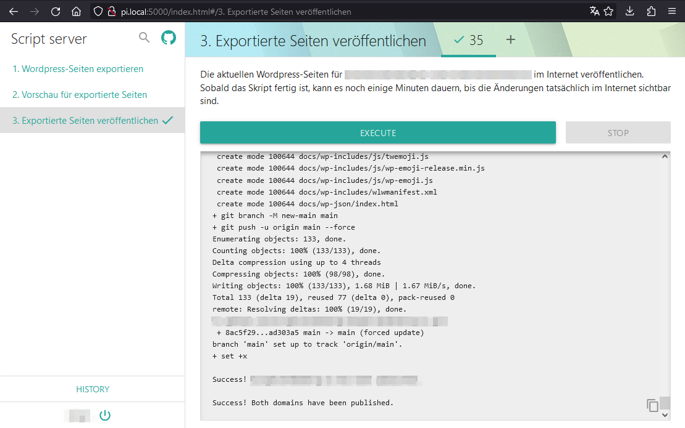

# Wordpress Automated Deploy

Deploying local Wordpress sites statically to GitHub Pages through a simple web interface.



## Requirements

Staatic must be installed on the Wordpress server: https://wordpress.org/plugins/staatic

WP-CLI must be installed on the Wordpress server.
For Docker the following compose configuration can be used:

```yaml
wpcli:
  image: wordpress:cli
  environment:
    WORDPRESS_DB_HOST: db
    WORDPRESS_DB_USER: exampleuser
    WORDPRESS_DB_PASSWORD: examplepass
    WORDPRESS_DB_NAME: exampledb
  volumes:
    - ./wp:/var/www/html/
  depends_on:
    - db
    - wordpress
```

Execute the following commands to create a properly configured output directory,
in case it is a local directory and mounted into the container:

```
sudo mkdir -p $WORDPRESS_DATA/wp-content/uploads/staatic
sudo chmod -R o+w $WORDPRESS_DATA/wp-content/uploads/staatic
```

## Manual Deployment (CLI)

Run the following commands in the root directory of the project:
```sh
./scripts/build.sh
./scripts/serve.sh # check if everything is okay with the export!
./scripts/deploy-all.sh
```

## Running the script server for deploying from a web interface

Python 3 must be installed on the server.
To download the script server (and delete any existing one), enter the following command:

```sh
make install
```

Note that when updating configuration values in the `conf` directory,
that all relative paths must be prefixed with `../../` if they should resolve to the project root.
After changing the script server config you can apply the changes with the following command:

```sh
make conf
```

Create a password file for authentication:

```sh
htpasswd -c .htpasswd user
```

Run the server with the following command:

```sh
make run
```

Or install it as a service, so it starts when the server boots,
by copying `scripts/script-server.service.example` to `script-server.service`
and making appropriate changes to "ExecStart", "User" and "Group",
then installing it to the system:

```sh
make install-service
```

Note that you have to set the user and group of the service to the user and group of Docker,
so that it can access running Wordpress containers.

## Personal Notes

- Set git config "user.name" and "user.email" to the appropriate GitHub user (use the --local flag)
  for this repository and both submodule repositories.
- Make sure critical containers in the docker-compose.yml have "restart: always" set.
  Namely the wordpress instance, the web server with deployment instructions
  and the script server to run deployment scripts from the web.
  Otherwise the containers might not start on system start.
